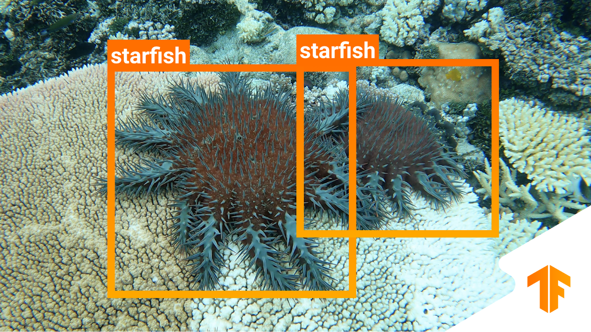
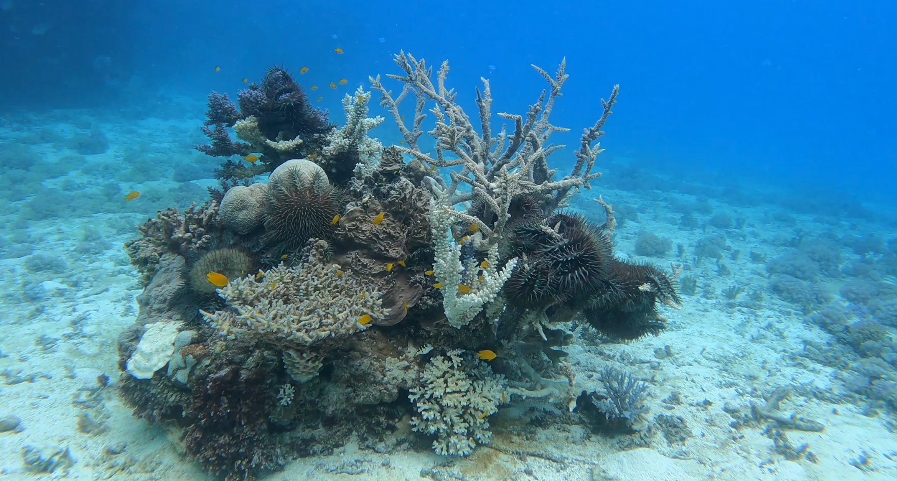
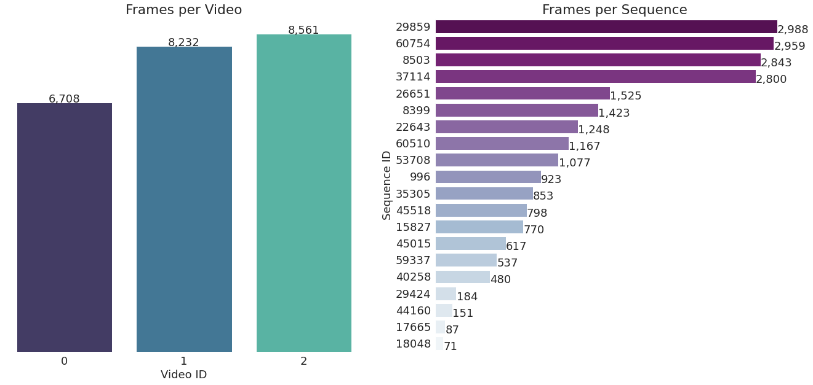
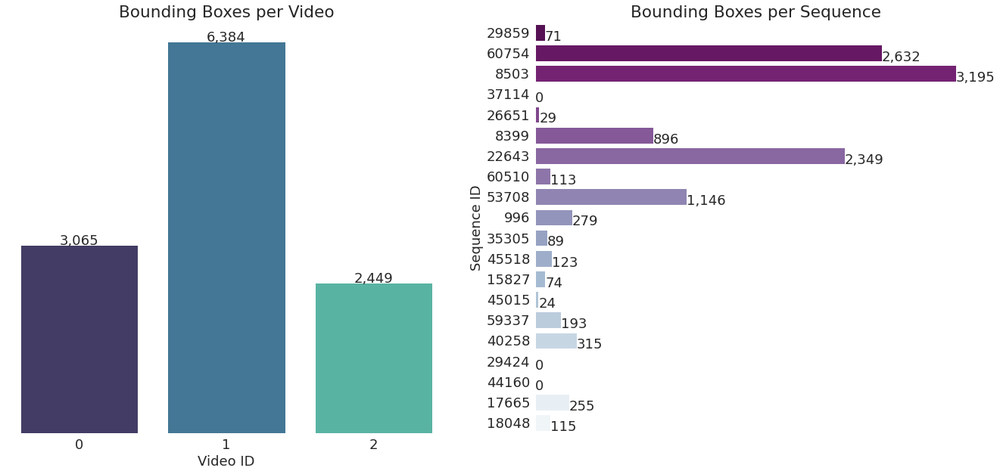

# Build an object detector to help the Great Barrier Reef :ocean:

> Author : Clément Apavou

## :tropical_fish: Introduction
The Australia's Greet Barrier Reef is threatened by outbreaks of crown-of-thorns starfish that devour corals too quickly. To protect the reef, the Great Barrier Reef foundation and the Australia's national science agency has partnered with Google to improve ineffective traditional survey methods. A Kaggle research code competition was created to expedite the research for an effective video survey method. The goal is to build an object detector capable of predicting the presence and position of crown-of-thorns starfish in underwater image sequences. This object detector will be used to determine the locations of outbreaks, so that methods can be applied to reduce their numbers in these locations. 

<p align="center">
  
</p>
<p align="center">
<em> Part of the sequence 60754 (COTS annotations) of the COTS dataset.</em>
</p>

<p align="center">
  
  
</p>
<p align="center">
<em> Crown-of-thorns starfishs (left) - A Crown-of-thorns starfish outbreak (right)</em>
</p>

## :tropical_fish: Dataset

<p align="center">
  
  
</p>
<p align="center">
<em> Number of frames per video and per sequence in the COTS dataset (left) - Number of bounding boxes per video and per sequence in the COTS dataset. (right)</em>
</p>

## :fish: Features of the repository
- Analyse dataset (split train/validation) : ```data_analysis.ipynb ```
- Dataset PyTorch for the COTS dataset : ```datasets/ReefDataset.py```
- Data augmentation with albumentation : ```datasets/transforms.py```
- Wandb logger to log experiments:  ```utils/WandbLogger.py```
    - log metrics 
    - log images (predictions/annotations)   
- Implementation of the F2-score metrics of the competition with [torchmetrics](https://torchmetrics.readthedocs.io/en/latest/) : ```utils/metrics.py```
- Beautiful terminal logger : ```utils/logger.py```
- Implementation of callbacks for early stopping and save weights by monitoring a metric : ```utils/callbacks.py```
- Faster R-CNN & RetinaNet from torchvision models (fine tuning implementation): ```models/FasterRCNN.py``` & ```models/RetinaNet.py```
- Possibility to use any optimizer and scheduler (following the config file template)
- Option fast dev run to debug (only 1 batch of train and validation are processed)

## :hammer: How does it work?  

1. Create a config file in ```config/``` by following templates
2. Launch the script ```main.py``` with the config file : 
``` 
python main.py --config_file config/config.yaml
```
3. Also, you can change use options to change launching configuration :
``` 
python main.py --config_file config/config.yaml --batch_size 2 --num_workers 2 --epoch 20 --csv_file path --root_path path
```
And you can use the ```--fast_dev_run``` option

The config file is read by the ```Trainer``` in ```agents/trainer.py``` which launch the training.

## :dolphin: Experiments
All experiments are available on wandb : [](https://wandb.ai/cots-detection/COTS_detection?workspace=user-clementapa)

Faster R-CNN:
- gallant-morning : without negative samples => 0.354 F2-score competition score (detection threshold 0.5) & 0.4027 F2-score validation (video 2)
- dry-microwave : with negative samples
- volcanic-water : without negative samples

RetinaNet: (different data augmentation and hyperparameters)
- dry-armadillo
- fallen-sun 
- smart-music 
- fiery-yogurt

## :ambulance: Fix albumentation error in bbox_utils.py on kaggle 
On kaggle :
```
cp albumentations/bbox_utils.py /opt/conda/lib/python3.7/site-packages/albumentations/augmentations/bbox_utils.py
```